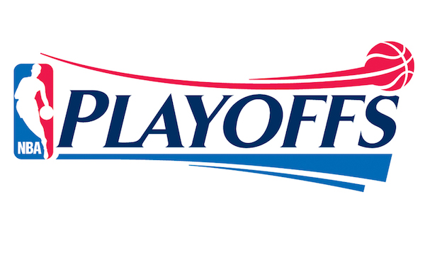

# NBA Tweets
Real-time Twitter stream for the 2016 NBA Playoffs
Keep up with all the latest draft rumors, free agent signings, and trade reports around the NBA! 
The 2015 NBA Summer League comes to Orlando July 4-10, Salt Lake City July 6-9, and Las Vegas July 10-20.




##Technology Stack

React, Express, Node, and socket.io

## Setup

Make sure you have MongoDB and Node.js installed. Navigate to the root directory and install all packages:

```
npm install
```

Inside of the root directory, create a `/data/db` path.

From the root directory, start your Mongo database:

```
mongod --dbpath data/db
```

Navigate to your root directory and start your Node.js server:

```
node server.js
```

Finally, navigate to `http://localhost:4040` to stream the tweets in real-time!
